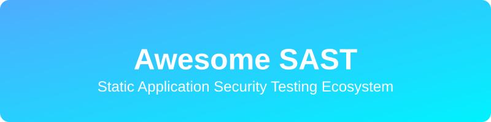

# Awesome SAST - The Ultimate Curated List of Static Application Security Testing Tools
## Top Static Application Security Testing (SAST) Ecosystem

**Curated List of SaaS Products & Open-Source GitHub Projects**  
*Focused on Code Scanning, Vulnerability Detection & Secure Development*  
**Last updated: March 2026**

This repository tracks notable **SaaS platforms** and **open-source projects** for **Static Application Security Testing (SAST)**. These tools scan source code for security vulnerabilities, code smells, and compliance issues without executing the program, helping teams ship more secure software.

**Examples** include Checkmarx, Veracode, SonarQube, Snyk Code, Semgrep, Fortify, GitLab SAST, CodeQL, DeepSource, Kiuwan, GitHub CodeQL, Contrast Scan, Mend SAST, and Coverity (the category leaders). Tools listed here emphasize **early vulnerability detection**, integration with CI/CD, and developer-friendly reporting.

**Open-source emphasis**: This section is heavily expanded with every major active project for self-hosting, local scanning, full customization, and transparency — ideal for development teams and security-conscious organizations.

Contributions welcome! Open a PR to add/update entries. Keep descriptions factual and link to official sites.

## 📑 Table of Contents
- [SaaS Products](#saas-products)
- [Open-Source GitHub Projects](#open-source-github-projects)
- [How to Contribute](#how-to-contribute)
- [Disclaimer](#disclaimer)

## ☁️ SaaS Products

### 🏢 Core Platforms (SAST Tools)

| Product | Company Size (Valuation/Market Cap) | Pricing & Free Tier | Description |
|---|---|---|---|
| **[CodeQL](https://codeql.github.com/)** (Microsoft) | ~$3 Trillion | Free for open-source. GitHub Advanced Security requires Enterprise. | Semantic code analysis engine used by GitHub for advanced vulnerability detection. |
| **[Coverity](https://www.synopsys.com/software-integrity/security-testing/static-analysis-sast.html)** (Synopsys) | ~$85 Billion | Enterprise pricing. Free for open-source (Coverity Scan). | Static analysis tool for finding critical defects and vulnerabilities. |
| **[Fortify](https://www.microfocus.com/en-us/products/static-code-analysis-sast)** (OpenText) | ~$10.5 Billion | Enterprise pricing only. No free tier. | Enterprise SAST solution with extensive language support and compliance features. |
| **[Snyk Code](https://snyk.io/product/snyk-code/)** | $7.4 Billion | Free tier: 100 tests/month. Pro starts at $52/mo. | Developer-first SAST with deep semantic analysis and fix suggestions. |
| **[GitLab SAST](https://about.gitlab.com/stages-devops-lifecycle/secure/)** | ~$6 Billion | Free tier: Basic SAST included. Ultimate starts at $99/user/mo. | Integrated SAST within GitLab's DevSecOps platform. |
| **[SonarQube](https://www.sonarqube.org/)** | $4.7 Billion | Free community edition (open source). Developer Edition starts at $160/year. | Popular code quality and security analysis platform with continuous inspection. |
| **[Veracode](https://www.veracode.com/)** | ~$2.5 Billion | Custom Enterprise pricing. No free tier. | Cloud-based application security platform with strong SAST capabilities. |
| **[Checkmarx](https://checkmarx.com/)** | ~$1.15 Billion | Custom Enterprise pricing. No free tier. | Comprehensive SAST solution with deep code analysis and developer IDE integration. |
| **[Contrast Scan](https://www.contrastsecurity.com/)** | >$1 Billion | Free tier: Contrast Community Edition. Enterprise varies. | Interactive application security testing with SAST components. |
| **[Mend SAST](https://www.mend.io/)** | ~$1 Billion | Custom Enterprise pricing. Free for open source (Mend Bolt). | SAST solution focused on open-source and proprietary code security. |
| **[Semgrep](https://semgrep.dev/)** | ~$300 Million | Free for individuals/open-source. Team starts at $20/user/mo. | Lightweight, rule-based SAST tool with fast scanning and custom rules. |
| **[DeepSource](https://deepsource.io/)** | ~$100 Million | Free for open source. Teams start at $12/user/mo. | Automated code review and SAST platform with actionable insights. |
| **[Kiuwan](https://www.kiuwan.com/)** (Idera) | Unknown | Custom Enterprise pricing. No free tier. | Application security and quality platform with SAST capabilities. |

## 🔓 Open-Source GitHub Projects

### 🔍 Dedicated SAST & Code Analysis Tools

- **[ESLint](https://github.com/eslint/eslint)** (with security plugins)   
  Pluggable linting utility for JavaScript and JSX with security rule sets.

- **[Trivy](https://github.com/aquasecurity/trivy)**   
  Comprehensive security scanner with SAST-like capabilities for code and dependencies.

- **[SonarQube Community Edition](https://github.com/SonarSource/sonarqube)**   
  Leading open-source code quality and security analysis platform with continuous inspection.

- **[Semgrep](https://github.com/semgrep/semgrep)**   
  Lightweight, fast, and highly customizable static analysis tool with community rules for many languages.

- **[Gosec](https://github.com/securego/gosec)**   
  Golang security checker with static analysis for common vulnerabilities.

- **[CodeQL](https://github.com/github/codeql)**   
  Open-source semantic code analysis engine used by GitHub for finding vulnerabilities.

- **[Brakeman](https://github.com/presidentbeef/brakeman)**   
  Static analysis security scanner for Ruby on Rails applications.

- **[Bandit](https://github.com/PyCQA/bandit)**   
  Python-specific static security analyzer with a focus on common vulnerabilities.

- **[PMD](https://github.com/pmd/pmd)**   
  Source code analyzer for Java, JavaScript, and other languages with security rules.

- **[SpotBugs](https://github.com/spotbugs/spotbugs)**   
  Successor to FindBugs for Java bytecode static analysis.

### ⭐ Additional Strong Open-Source Options

- **[OWASP Dependency-Check](https://github.com/jeremylong/DependencyCheck)** — Scans for vulnerable dependencies (complements SAST).
- **[FindSecBugs](https://github.com/find-sec-bugs/find-sec-bugs)** — Security-focused SpotBugs plugin for Java.
- **[NodeJSScan](https://github.com/ajinabraham/nodejsscan)** — Static security scanner for Node.js applications.
- **[phpcs-security-audit](https://github.com/FloeDesignTechnologies/phpcs-security-audit)** — Security sniffing for PHP.
- **[Many community Semgrep rulesets** for custom SAST.
- **[OpenVAS / Greenbone** for broader vulnerability scanning.

**Frameworks for building custom SAST**: Combine **Semgrep**, **SonarQube**, **Bandit**, and **CodeQL** with CI/CD pipelines for comprehensive open-source security scanning.

## 🤝 How to Contribute

1. Fork the repo.
2. Add/edit entries in `README.md` (follow existing format).
3. Include: name, link, 1–2 sentence description, and whether it's SaaS or open-source.
4. Submit PR with a short explanation.

Star the repo if you find it useful!

## ⚠️ Disclaimer

- This is a **community-curated** list — not exhaustive and not an endorsement.
- SAST tools should be part of a broader security strategy including DAST, IAST, and manual review.
- Self-hosted open-source solutions require proper configuration and regular updates.

---

**Made for security engineers, developers, DevSecOps teams, and open-source contributors.**  
Let's make application security more accessible, transparent, and effective.
